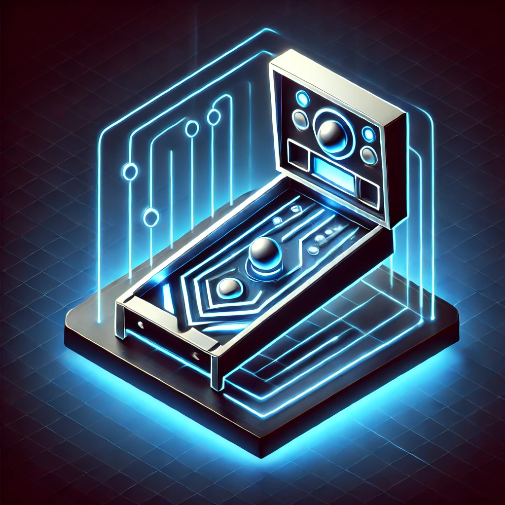

# Welcome to VPX Game Logic Framework

{ align=right width=200 }

The VPX Game Logic Framework (GLF) is a powerful and flexible framework for creating original virtual pinball tables using the [VPX](https://github.com/vpinball/vpinball) platform. It provides a comprehensive set of game logic components that enable you to build sophisticated pinball games without writing extensive code.

## About This Framework

GLF is inspired by [The Mission Pinball Framework](https://missionpinball.org) for real and homebrew machines. Many of the game logic commands mirror the MPF commands, allowing for interchangeable configurations between VPX and MPF. This makes it easier to transition between virtual and physical pinball development.

One of the key goals of this project is to provide a standalone set of game logic devices that doesn't require users to install and run the MPF bridge for VPX, simplifying the development process.

## Key Features

- **Virtual Devices**: Comprehensive support for flippers, bumpers, drop targets, magnets, and more
- **Game Modes**: Flexible mode system for creating complex game rules and progression
- **Event System**: Powerful event-driven architecture for game logic
- **Player Management**: Track player scores, achievements, and high scores
- **Light Control**: Advanced lighting effects and animations
- **Backbox Displays**: Options for segment displays to full LCD Displays

## Quick Start

1. **Installation**: Follow the [Installation Guide](installing.md) to set up GLF
2. **Tutorials**: Start with our [tutorial series](tutorial/tutorial-trough.md) to learn the basics
3. **Configuration**: Explore the [Game Logic](shot.md) documentation to understand available components

## Getting Help

- **Community**: Reach out to Flux or Apophis on discord and ask for a link to join our community discord for support and discussion.

## License

This project is licensed under the MIT License - see the LICENSE file for details.
