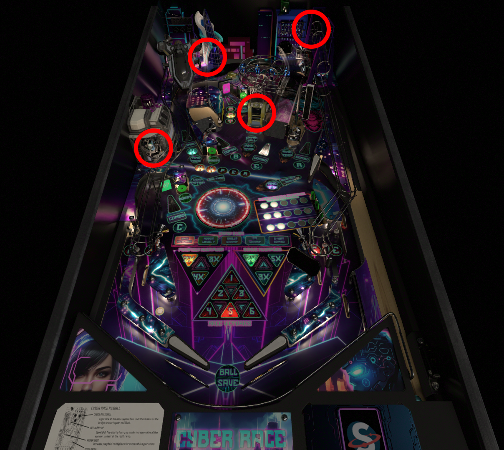

# Tutorial - Ball Devices

Ball devices are anything in your game that capture balls from the playfield. These can be scoops, vuks (vertical up kickers), troughs, plungers, multiball locks e.t.c. 

[See Ball Device Config Reference](../../ball-device)

Below is an image of Cyber Race pinball. Apart from the trough and plunger it has four circled ball devices. There are three vuks and one scoop. All of these devices collect, hold balls and release them.



### Setup

A ball device will need a switch to determine when a ball has entered and some way of holding the ball physically. There are many ways to do this in VPX such as using a kicker object or building an enclosure with walls. 

### Configuration

To configure your device add the config below to your Configure Glf Devices Sub.

```
Sub ConfigureGlfDevices
  
    ' Scoop
    With CreateGlfBallDevice("scoop")
        .BallSwitches = Array("sw04")
        .EjectTimeout = 2000
		.EjectCallback = "ScoopEjectCallback"
    End With

    'Other device config....
End Sub
```

The above configuration sets up the scoop device with a switch called **sw04**. When the ball enters the scoop and the game is expecting the ball to enter, the ball will be held until released by the system. Once released it will be ejected by calling the **EjectCallback** function. This is a function you define which will kick the ball in the direction you wish.

## Next Steps

[Example Ball Save](../tutorial-ballsave/)